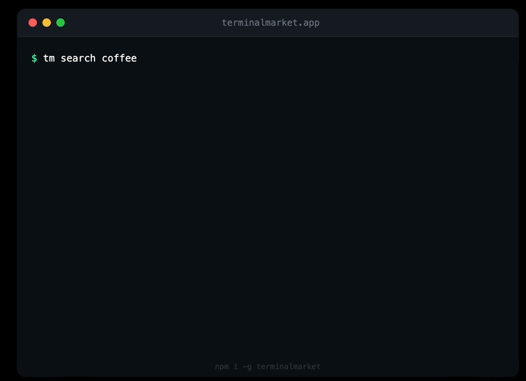
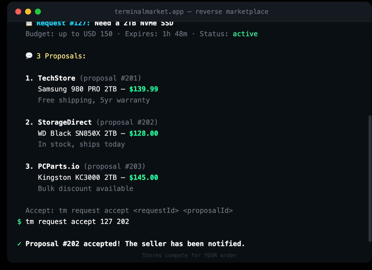

# TerminalMarket CLI

The official command-line interface for [TerminalMarket](https://terminalmarket.app) — a developer marketplace that lives in your terminal.

Search, buy, and manage orders without leaving the command line. Unix pipes, price alerts, reverse marketplace — all from `tm`.

## Demo

### Search & Buy



### Reverse Marketplace — stores compete for your order


### Watch & Price Alerts via Telegram



## Installation

### npm (requires Node.js)

```bash
npm install -g terminalmarket
```

### Standalone binary (no Node.js needed)

```bash
curl -fsSL https://terminalmarket.app/install.sh | sh
```

This installs `tm` into `~/.local/bin`.

## Quick Start

```bash
tm register you@email.com          # Create account
tm search coffee                   # Browse products
tm search coffee | sort price      # Unix pipes work!
tm add coffee-03                   # Add to cart
tm cart                            # View cart
tm checkout                        # Buy
```

## Commands

### Authentication

```bash
tm register <email> [password]     # Create a new account
tm login <email> [password]        # Login to your account
tm logout                          # Logout
tm whoami                          # Show current user info
tm me                              # Alias for whoami
tm auth github                     # Login with GitHub (opens browser)
```

### Shopping & Pipes

```bash
tm products                        # List all products
tm products --category coffee      # Filter by category
tm search "coffee"                 # Search products
tm search coffee | sort price      # Sort by price (pipes!)
tm search coffee | head 3          # First 3 results
tm search coffee | count           # Count results
tm search nut | filter --max-price 10 | sort price  # Chain pipes
tm view <product-id>               # View product details
tm add <product-id>                # Add to cart
tm cart                            # View cart
tm cart add <product-id>           # Add to cart
tm cart remove <product-id>        # Remove from cart
tm cart clear                      # Clear cart
tm checkout                        # Proceed to checkout
```

### Reverse Marketplace

Post what you need — sellers compete with offers.

```bash
tm request create Need a laptop --budget 700 --category hardware
tm request list                    # Your requests
tm request view <id>               # View proposals from sellers
tm request accept <requestId> <proposalId>  # Accept best offer
```

### Watch & Price Alerts

Set up persistent monitoring. Get notified via Telegram or in-app.

```bash
tm watch create search coffee --sort price --name "Coffee deals" --notify telegram
tm watch list                      # List watch rules
tm watch logs <id>                 # View match history
tm watch pause <id>                # Pause a rule
tm watch resume <id>               # Resume a rule
tm watch delete <id>               # Delete a rule
```

### Telegram Integration

```bash
tm telegram link <code>            # Link Telegram for notifications
tm telegram status                 # Check connection
tm telegram unlink                 # Disconnect
```

### Orders

```bash
tm orders                          # View order history
tm history                         # Alias for orders
```

### Jobs

```bash
tm jobs                            # Browse job listings
tm jobs list                       # List all vacancies
tm jobs view <id>                  # View job details
tm jobs apply <id>                 # Apply to a job
tm jobs my                         # Your applications
```

### Stores & Reviews

```bash
tm sellers                         # List all sellers/stores
tm stores                          # Alias for sellers
tm seller <slug>                   # View seller details
tm store <store-id>                # View store details
tm reviews <store-id>              # View store reviews
tm review <store-id> <rating> [comment]  # Leave a review (1-5 stars)
```

### AI Services

Run AI models directly from the terminal using credits.

```bash
tm ai list                         # List available AI models
tm ai run <model> <input>          # Run an AI model
tm ai credits                      # Check your credit balance
tm ai topup <amount>               # Add credits ($5 minimum)
tm ai history                      # View usage history
tm credits                         # Shortcut
tm topup <amount>                  # Shortcut
```

### Aliases & Rewards

```bash
tm alias list                      # List your aliases
tm alias add <name> <command>      # Create alias (e.g. "morning-coffee" -> "add coffee-03")
tm alias remove <name>             # Remove alias
tm aliases                         # Shortcut

tm reward list                     # List reward rules
tm reward add <product> <pushes>   # Auto-order after N git pushes
tm reward remove <id>              # Remove reward rule
tm rewards                         # Shortcut
```

### Profile

```bash
tm profile                         # View your profile
tm profile set name "John Doe"     # Update your name
tm profile set phone "+1234567890" # Update phone
tm profile set address "123 Main"  # Update address
tm profile set city "Berlin"       # Update city
tm profile set country "DE"        # Update country
```

### Categories

```bash
tm categories                      # List all categories
tm category <slug>                 # List products in category
tm offers                          # List all offers
```

Available categories: `coffee`, `lunch`, `snacks`, `focus`, `health`, `coworking`, `digital`, `services`, `hardware`, `events`, `b2b`, `travel`, and more.

### Merchant (Sellers)

```bash
tm merchant dashboard              # Seller dashboard
tm merchant product create --name "..." --price 10 --category coffee --description "..."
tm merchant orders                 # View store orders
tm merchant analytics              # Sales analytics
```

### Configuration

```bash
tm config get api                  # Show API endpoint
tm config set api <url>            # Set custom API endpoint
tm about                           # About TerminalMarket
tm --help                          # Show help
tm --version                       # Show version
```

## Pipe Examples

TerminalMarket CLI supports Unix-style pipes:

```bash
# Find cheapest coffee
tm search coffee | sort price | head 1

# Count snacks under $10
tm search snacks | filter --max-price 10 | count

# Monitor laptop prices via Telegram
tm watch create search laptop --sort price --name "Laptop tracker" --notify telegram

# One-command morning routine (via alias)
tm alias add morning "add coffee-03"
tm morning
```

## Configuration

The CLI stores configuration in `~/.config/terminalmarket/config.json`:

- `apiBase`: API endpoint (default: `https://terminalmarket.app/api`)
- `sessionCookie`: Session cookie for authentication
- `user`: Cached user info

## Building Binaries

See [INSTALL_BINARIES.md](./INSTALL_BINARIES.md) for instructions on building standalone binaries.

```bash
npm ci
npm run build:bin
```

This produces binaries in `dist/`:
- `tm-linux-x64`
- `tm-macos-x64`
- `tm-macos-arm64`

## License

MIT
